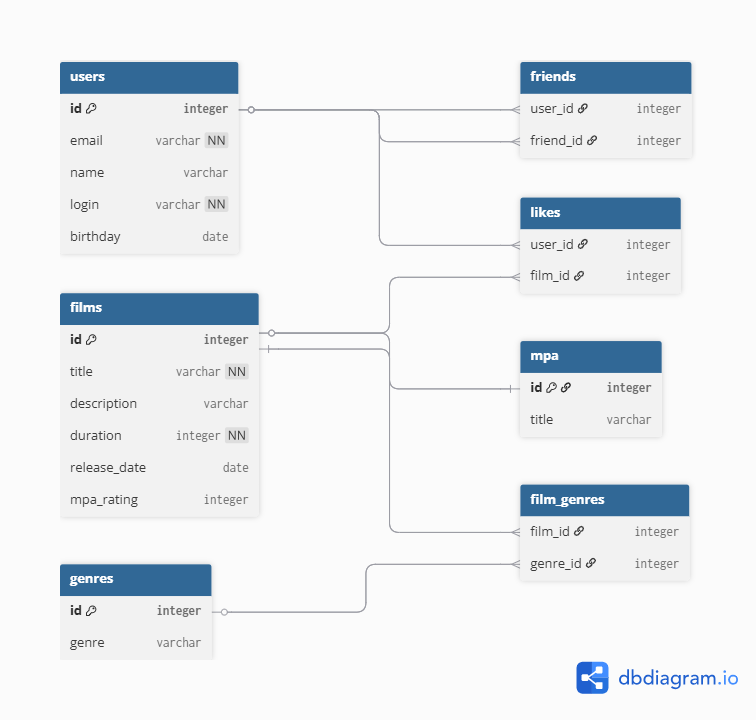

# java-filmorate


## Примеры основных запросов
- список всех пользователей:
```
SELECT *
FROM users;
```
- найти пользователя по id:
```
SELECT *
FROM users
WHERE id = ?;
```
- добавить пользователя:
```
INSERT INTO users (email, name, login, birthday)
VALUES (?, ?, ?, ?);
```
- получить MPA-рейтинг фильма по id:
```
SELECT mpa.title
FROM mpa
JOIN films f ON mpa.id = f.mpa_rating
WHERE f.id = ?;
```